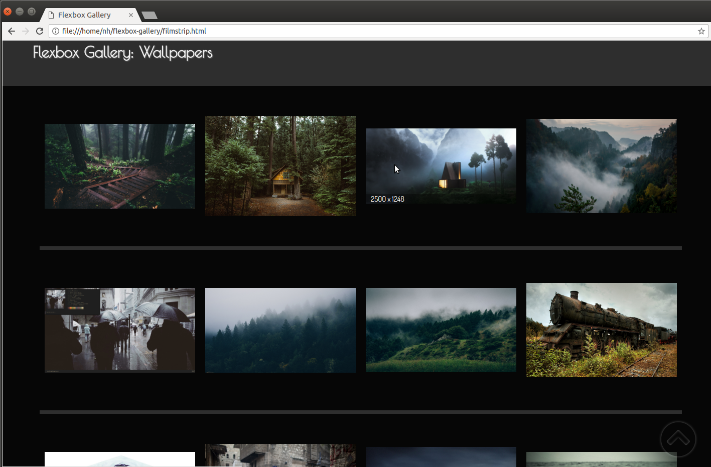

# Flexbox Gallery
A responsive photo gallery especially suited to large images that takes advantage of flexbox and other new ES6/HTML5/CSS3 capabilities. Emphasis on UI design and UX.

Features include:
* responsive grid that handles different image aspect ratios smoothly
* customizable slide-up tooltips
* optimized background loading of high resolution images from thumbnails
* enhanced feedback when loading large images
